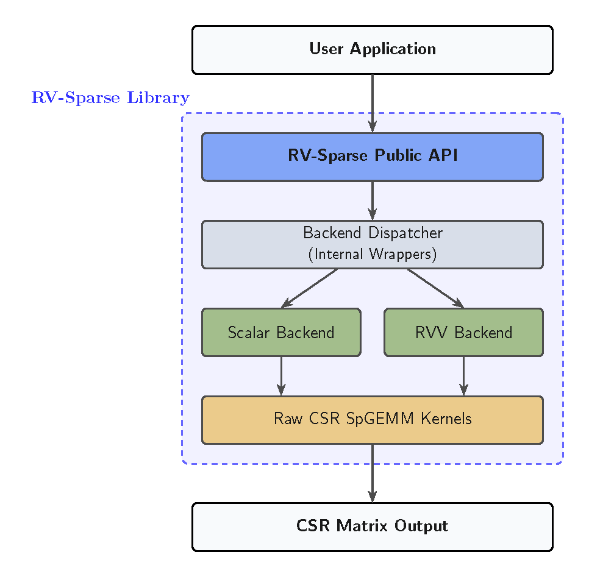
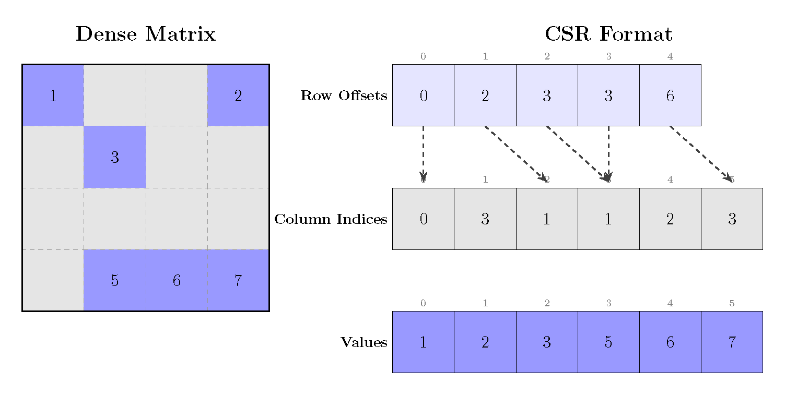
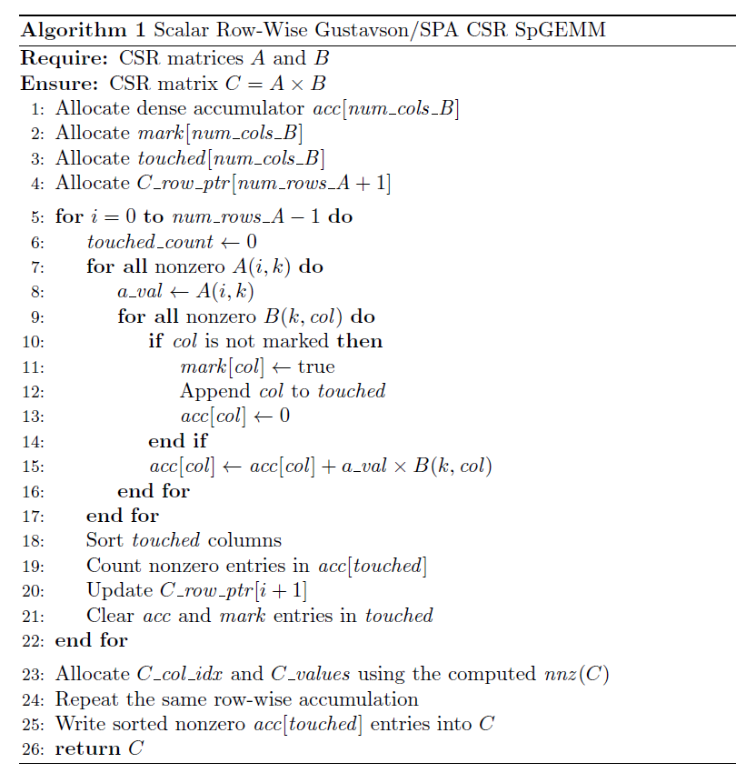
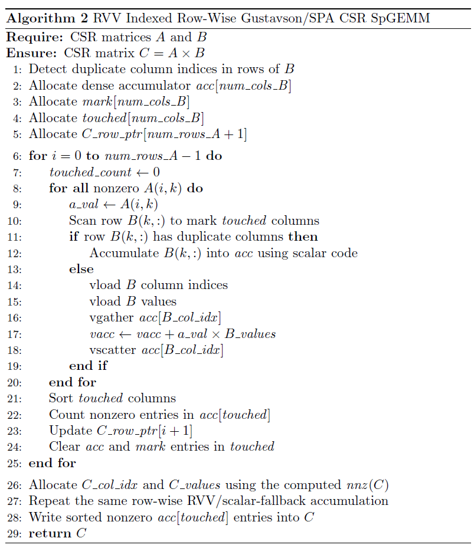
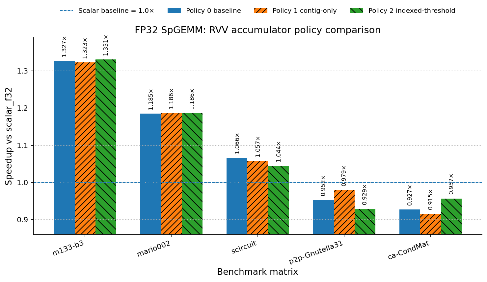
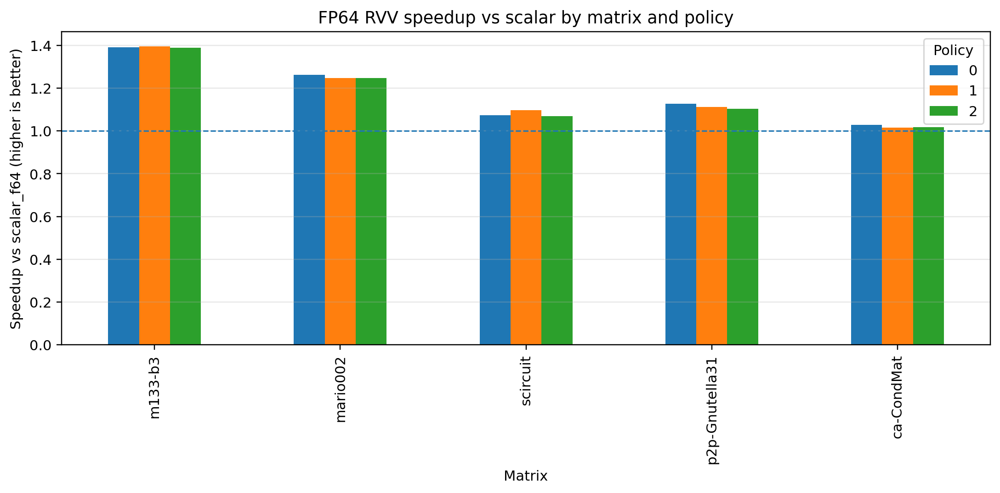

# RV-Sparse

<p align="center">
  
</p>

**RV-Sparse** is an open-source sparse linear algebra library for RISC-V, with experimental support for RISC-V Vector (RVV) acceleration.

The project focuses on CSR-based Sparse General Matrix-Matrix Multiplication (SpGEMM) and provides scalar reference kernels, RVV experimental kernels, backend dispatch infrastructure, examples, and documentation for performance-oriented sparse computing.

```text
C = A × B
```

where `A`, `B`, and `C` are sparse matrices.

---

## Overview

RV-Sparse is designed as a modular C library for sparse matrix computation on RISC-V platforms.

The library currently provides:

- CSR sparse matrix representation.
- CSR SpGEMM kernels.
- Scalar baseline implementations.
- Experimental RISC-V Vector kernels.
- INT8, FP32, and FP64 kernel paths where available.
- Two-pass exact output preallocation.
- Gustavson/SPA-style row-wise accumulation.
- Backend selection infrastructure.
- Examples and documentation for development and evaluation.

The project is currently under active development and is being prepared as part of a mid-evaluation RISC-V sparse linear algebra submission.

---

## Main Features

- **CSR-first sparse matrix support**
- **CSR SpGEMM: `C = A × B`**
- **Scalar reference kernels**
- **Experimental RVV kernels**
- **Backend-oriented design**
- **Support for multiple data types**
- **Exact output preallocation**
- **Performance analysis friendly structure**
- **Clean separation between public API and raw kernels**

---

## High-Level Architecture

RV-Sparse is organized in layers:

<p align="center">
  
</p>

This design keeps the user-facing API stable while allowing different kernel implementations underneath.

Raw kernels are intentionally separated from the public API so they can be benchmarked, profiled, replaced, or optimized independently.

---

## Supported Matrix Format

### CSR: Compressed Sparse Row

<p align="center">
  
</p>
<!--  -->

RV-Sparse currently focuses on CSR matrices.

A sparse matrix in CSR format is represented by:

```text
rows      number of matrix rows
cols      number of matrix columns
nnz       number of nonzero values
row_ptr   row offset array of length rows + 1
col_idx   column index array of length nnz
values    nonzero values array of length nnz
```

For a matrix `A`, row `i` is stored in:

```text
row_start = row_ptr[i]
row_end   = row_ptr[i + 1]
```

The nonzeros in row `i` are:

```text
for p = row_start to row_end - 1:
    column = col_idx[p]
    value  = values[p]
```

---

## CSR Example

Dense matrix:

```text
A = [ 10  0  0  2
       3  9  0  0
       0  7  8  0
       0  0  0  6 ]
```

CSR representation:

```text
rows    = 4
cols    = 4
nnz     = 7

values  = [10, 2, 3, 9, 7, 8, 6]
col_idx = [ 0, 3, 0, 1, 1, 2, 3]
row_ptr = [ 0, 2, 4, 6, 7]
```

---

## Current Scope

The current development focus is CSR SpGEMM:

```text
C = A × B
```

where `A`, `B`, and `C` are sparse matrices in CSR format.

Implemented or under active development:

- CSR matrix representation.
- CSR SpGEMM scalar backends.
- CSR SpGEMM RVV experimental backends.
- Two-pass preallocation strategy for exact output allocation.
- SPA/Gustavson-style row accumulation.
- INT8, FP32, and FP64 kernel paths where available.
- Example programs and matrix data utilities.
- Benchmark and profiling-oriented metadata collection.

---

## CSR SpGEMM Execution Model

RV-Sparse currently uses a row-wise Gustavson/SPA-style SpGEMM algorithm.

For each row `i` of `A`:

```text
for each nonzero A(i,k):
    scan row B(k,:)
    accumulate into temporary row accumulator
```

Conceptually:

```text
C(i,j) += A(i,k) * B(k,j)
```

The temporary workspace tracks which columns have been touched in the current output row.

Typical workspace:

```text
acc[col]      temporary accumulated value
mark[col]     whether column col was touched
touched[]     list of touched columns
```

This avoids clearing the full dense accumulator for every row.

---

## Algorithm 1: Scalar Row-Wise Gustavson/SPA CSR SpGEMM


<p align="center">
  
</p>
<!--  -->

---

## Algorithm 2: RVV Indexed Row-Wise Gustavson/SPA CSR SpGEMM

The RVV path attempts to vectorize the accumulation over entries of rows of `B`.

Because sparse accumulation uses indirect column indices, the RVV implementation may require indexed loads and stores into the accumulator.

<p align="center">
  
</p>

---

> Note: The RVV kernels are experimental and are not assumed to be faster for every sparse workload.

---

## SpGEMM Mid-Evaluation and Optimization Roadmap

This section documents the current SpGEMM optimization work, including the FP32 kernel evolution from `v1` to `v2`, the RVV accumulator policy framework, the FP64 RVV policy result, the selective FP32 tiled path, and the planned descriptor-based API direction.

### Evolution of SpGEMM kernel 

The FP32 SpGEMM RVV path has gone through two implementation stages:

- **v1:** initial FP32 RVV implementation and first benchmark baseline.
- **v2:** reworked kernel family focused on reducing overhead outside the accumulator path.

The `v2` implementation improves over `v1` by removing several sources of overhead:

- generic per-row `qsort` was replaced with a direct integer sort path;
- validation was moved out of the hot loop and treated as a canonical CSR precondition;
- repeated per-call duplicate scans were removed for canonical CSR inputs.

These changes reduce sorting, validation, and setup overhead, which explains the observed performance improvement of `v2` over the initial implementation.

### Canonical CSR precondition

The optimized `v2` kernels assume canonical CSR input:

- `row_ptr[0] == 0`;
- `row_ptr` is non-decreasing;
- column indices are in range;
- column indices are sorted within each row;
- there are no duplicate column entries within a row.

This allows the compute kernels to avoid repeated checks inside hot loops. Input validation should happen once after loading or constructing a matrix, outside timed regions. If an input is not canonical, it should be checked, sorted, or canonicalized before calling the optimized kernels.

### RVV accumulator policy framework

The RVV accumulator policy framework is complementary to the `v2` cleanup. It makes the FP32 and FP64 RVV accumulation paths tunable without changing the public kernel interface.

The current policies are:

- **Policy 0:** baseline contiguous + indexed RVV;
- **Policy 1:** scan-ahead contiguous-only RVV;
- **Policy 2:** scan-ahead with indexed RVV only for large irregular regions.

The policy framework helps evaluate which accumulation strategy works best for each sparsity pattern. The final RVV path should combine the lower-overhead `v2` structure with the best accumulator policy behavior.

### FP32 policy result

Across the focused FP32 real-matrix set, no single policy dominates every matrix. Policy 0 is the safest default because it keeps the optimized indexed RVV path enabled and provides stable behavior, while Policy 1 and Policy 2 remain useful tuning options for specific sparsity patterns.

| Matrix | Policy 0 | Policy 1 | Policy 2 |
| --- | ---: | ---: | ---: |
| `m133-b3` | 1.327x | 1.323x | 1.331x |
| `mario002` | 1.185x | 1.186x | 1.186x |
| `scircuit` | 1.066x | 1.057x | 1.044x |
| `p2p-Gnutella31` | 0.952x | 0.979x | 0.929x |
| `ca-CondMat` | 0.927x | 0.915x | 0.957x |

<p align="center">
  
</p>

The FP32 policy results show strong wins on `m133-b3`, `mario002`, and `scircuit`, while `p2p-Gnutella31` and `ca-CondMat` remain closer to scalar and require more selective handling.

### FP64 policy result

The FP64 RVV path mirrors the optimized FP32 accumulator structure with FP64-specific defaults.

Policy 0 `rvv_f64` vs `scalar_f64` on the focused five-matrix set:

| Metric | Result |
| --- | ---: |
| Mean speedup | 1.176x |
| Median speedup | 1.127x |
| Wins | 5/5 |

Per-matrix Policy 0 speedups:

| Matrix | Speedup |
| --- | ---: |
| `m133-b3` | 1.390x |
| `mario002` | 1.262x |
| `p2p-Gnutella31` | 1.127x |
| `scircuit` | 1.074x |
| `ca-CondMat` | 1.029x |

<p align="center">
  
</p>

The FP64 results are stronger and more stable than the FP32 RVV results on the focused matrix set. Policy 0 is the recommended FP64 default.

### FP32 tiled path

The FP32 tiled kernel is a selective optimization, not a global replacement for the default FP32 RVV path.

The tiled path is expected to help mainly when `B.cols` is large enough that full-width accumulator workspace creates memory pressure. In those cases, tiling reduces the active accumulator, mark, and touched workspace to a fixed column range.

Initial intended use:

- use default `rvv_f32` for normal or small-column matrices;
- consider `rvv_f32_tiled` when `B.cols` is large and full-width accumulation becomes expensive;
- keep `rvv_f32_tiled` as an opt-in or auto-selected path until benchmark data confirms where it wins.

The next benchmark stage should compare:

- `scalar_f32`;
- `rvv_f32`;
- `rvv_f32_tiled`.

The tiled sweep should test multiple tile sizes:

- `RVSP_RVV_F32_TILE_COLS=2048`;
- `RVSP_RVV_F32_TILE_COLS=4096`;
- `RVSP_RVV_F32_TILE_COLS=8192`;
- `RVSP_RVV_F32_TILE_COLS=16384`;
- `RVSP_RVV_F32_TILE_COLS=32768`.

The goal is to determine when tiling should be enabled automatically.

### Descriptor-based SpGEMM API direction

A descriptor-based SpGEMM API is a good long-term direction for the library. The descriptor would hold algorithm selection, workspace metadata, and reusable symbolic structure between calls.

The proposed direction is:

```c
typedef struct rvsp_spgemm_descr *rvsp_spgemm_descr_t;
```

The descriptor API should expose an advanced path while preserving the existing simple SpGEMM call as a convenience wrapper.

Recommended advanced sequence:

```c
rvsp_spgemm_descr_t d;

rvsp_spgemm_descr_create(&d);
rvsp_spgemm_set_algo(d, RVSP_SPGEMM_ALGO_DEFAULT);

rvsp_spgemm_symbolic(d, &A, &B, &workspace_bytes, &c_nnz);

/* Caller allocates C using c_nnz and allocates workspace. */

rvsp_spgemm_numeric(d, &A, &B, &C, workspace);

rvsp_spgemm_descr_destroy(d);
```

The recommended memory ownership model is caller-allocated `C`. This preserves structure reuse: if `A` and `B` keep the same sparsity pattern but only their values change, the symbolic structure can be reused and only the numeric phase needs to run again.

The descriptor should eventually support:

- algorithm selection;
- symbolic and numeric phase separation;
- workspace reuse;
- FP32, FP64, and tiled kernel dispatch;
- future threading and per-thread workspace management;
- auto-selection based on matrix shape, sparsity pattern, and data type.

This API refactor should be developed separately from the current kernel performance work. The current priority is to finalize and benchmark the RVV FP32, RVV FP64, and selective FP32 tiled kernels. Once those kernels are stable, the descriptor API can wrap them cleanly and provide the foundation for automatic dispatch and parallel execution.

### Parallelization roadmap

After the RVV FP32, RVV FP64, and selective FP32 tiled kernels are stabilized, the next optimization stage is parallel execution.

The most natural parallelization direction is row partitioning:

- split the output rows of `C` across worker threads;
- give each thread its own local accumulator workspace;
- avoid shared writes during row accumulation;
- merge only through the final CSR output layout.

The descriptor API provides a natural place to store threading configuration, workspace sizes, row partitions, and algorithm selection metadata.

---

## Build

A standard local build can be started with:

```bash
make clean
make
```

For a RISC-V cross-compilation environment:

```bash
make clean
make CC=riscv64-unknown-linux-gnu-gcc
```

For RVV-enabled builds, the compiler must support RISC-V Vector intrinsics and the target architecture must include vector support.

Example target flags may include:

```text
-march=rv64gcv
-mabi=lp64d
```

The exact compiler flags depend on the toolchain and target platform.

---

## Quick Start

### Include the library header

```c
#include "rv_sparse.h"
```

### Create CSR matrices

A CSR matrix is described using row pointers, column indices, and values.

```c
rvsp_csr_matrix_t A;
rvsp_csr_matrix_t B;
rvsp_csr_matrix_t C;
```

Example conceptual initialization:

```c
A.rows = M;
A.cols = K;
A.nnz = A_nnz;
A.row_ptr = A_row_ptr;
A.col_idx = A_col_idx;
A.values = A_values;

B.rows = K;
B.cols = N;
B.nnz = B_nnz;
B.row_ptr = B_row_ptr;
B.col_idx = B_col_idx;
B.values = B_values;
```

### Select SpGEMM options

```c
rvsp_spgemm_options_t options;

options.backend = RVSP_BACKEND_AUTO;
options.dtype = RVSP_DTYPE_F32;
```

### Run SpGEMM

```c
rvsp_status_t status = rvsp_spgemm_csr(&A, &B, &C, &options);

if (status != RVSP_SUCCESS) {
    /* handle error */
}
```

### Release output memory

```c
rvsp_csr_free(&C);
```

The exact public API may evolve as the project stabilizes. See `include/` and `docs/api_design.md` for the current definitions.

---

## Backend Selection

RV-Sparse is designed to support multiple backends.

Typical backend modes include:

```text
RVSP_BACKEND_AUTO
RVSP_BACKEND_SCALAR
RVSP_BACKEND_RVV
```

Recommended behavior:

```text
AUTO    library selects an available backend
SCALAR  force scalar baseline implementation
RVV     force RVV implementation when available
```

Scalar backends are used as correctness and performance baselines. RVV backends are experimental and should be validated on the target workload and hardware.

---

## Data Types

The project includes or is actively developing kernel paths for:

```text
INT8
FP32
FP64
```

Backend availability may differ by data type.

---

## Repository Layout

```text
include/      Public headers and API definitions
src/          Library implementation
examples/     Example programs and usage demos
tests/        Validation tests
docs/         Project documentation
scripts/      Utility scripts
matrices/     Matrix inputs used for experiments
matrix_data/  Additional matrix-related data
```

More details are available in:

```text
docs/directory_structure.md
```

---

## Documentation

Available documentation:

- [Documentation index.](docs/README.md)

- [API and backend architecture.](docs/api_design.md)  

- [Repository structure and file organization.](docs/directory_structure.md)  

---

## Examples

Example programs are located in:

```text
examples/
```

Typical usage:

```bash
make examples
```

or, depending on the available Makefile targets:

```bash
make
./examples/<example_binary>
```

See the `examples/` directory for currently available programs.

---

## Testing

Run the available tests with:

```bash
make test
```

If the Makefile does not yet expose a test target, tests can be built and run manually from the `tests/` directory.

---

## Development Status

RV-Sparse is currently experimental.

The scalar kernels are used as correctness and performance baselines. RVV kernels are being evaluated and optimized using profiling data, matrix workload characterization, and hardware counters.

The current goal is to make the library usable, testable, and extensible while progressively improving RVV performance.

---

## Contributing

Contributions should keep changes focused and easy to review.

Recommended workflow:

1. Create a feature branch.
2. Add or update the relevant kernel/API code.
3. Add correctness tests.
4. Add or update examples if user-facing behavior changes.
5. Benchmark against the scalar baseline.
6. Document backend limitations and performance assumptions.
7. Submit a pull request.

See:

[CONTRIBUTING.md](CONTRIBUTING.md)

---

## License

See:

[LICENSE](LICENSE)

