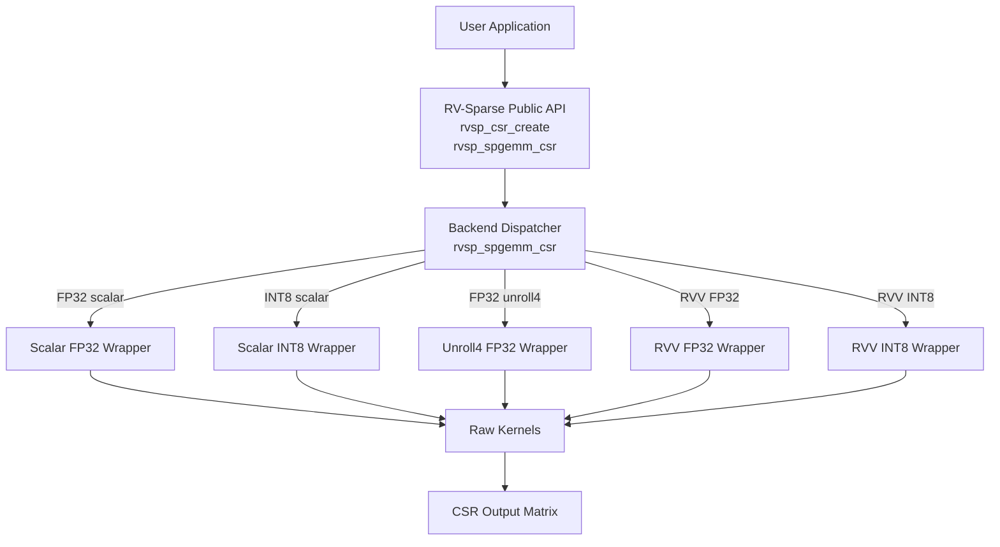
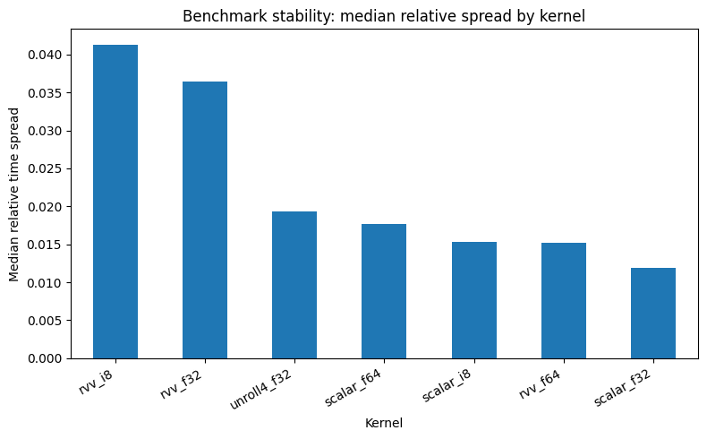
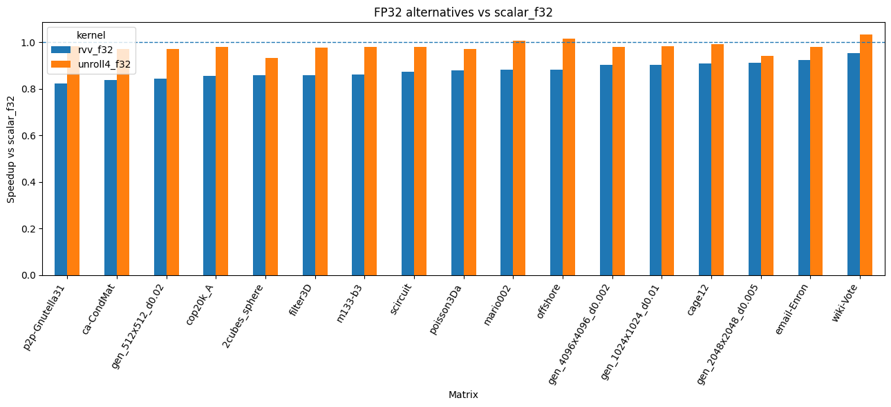

# RV-Sparse

<p align="center">
  
</p>

**RV-Sparse** is an open-source sparse linear algebra library for RISC-V, with experimental support for RISC-V Vector (RVV) acceleration. The project focuses on CSR-based Sparse General Matrix-Matrix Multiplication (SpGEMM) and provides scalar reference kernels, experimental RVV kernels, backend dispatch infrastructure, performance evaluation tools, and documentation for performance-oriented sparse computing on RISC-V platforms.

```text
C = A × B
```

where `A`, `B`, and `C` are sparse matrices in Compressed Sparse Row (CSR) format.

---

## Motivation

Sparse linear algebra is a cornerstone of scientific computing, but sparse workloads present unique optimization challenges that differ fundamentally from dense linear algebra.

### Why Sparse Matters

Sparse matrices emerge naturally from graph computations, finite element methods, machine learning embeddings, iterative solvers, and graph neural networks. Many real-world problems are sparse—often extremely sparse—and dense algorithms waste computation and memory on implicit zeros. Specialized sparse kernels can deliver orders of magnitude speedup.

### Why SpGEMM Is Important

Sparse matrix-matrix multiplication (SpGEMM) is a critical bottleneck in many applications:

- Graph algorithms (shortest paths, centrality measures)
- Iterative linear solvers and eigenvalue computations
- Machine learning inference (sparse embeddings, graph neural networks)
- Symbolic computation and compiler optimization passes
- Tensor contraction and scientific simulations

Unlike SpMV (sparse matrix-vector multiplication), SpGEMM must produce sparse output, making the output size data-dependent and unpredictable.

### The Challenge of Sparse Optimization

Sparse computation is notoriously difficult to optimize because:

- **Irregular memory access**: Sparse matrices lack dense row or column structure, producing indirect memory references and poor cache locality.
- **Data-dependent output**: The number of nonzeros in the output matrix depends on the input structure, making preallocation and load balancing difficult.
- **Low arithmetic intensity**: Sparse kernels often move more data than they compute, leading to memory-bound behavior.
- **Fine-grained indexing overhead**: Computing with compressed indices adds pointer chasing and indirection.
- **Difficult vectorization**: Vectorization requires regular memory patterns, but sparse computation is inherently irregular.

### RISC-V and RVV as Research Targets

RISC-V is an open, modular ISA that enables custom optimization and hardware research without proprietary constraints. RISC-V Vector (RVV) is a scalable vector extension that can dynamically adjust vector length (VLEN) based on hardware capabilities, making it theoretically suitable for irregular workloads.

However, **RVV does not automatically accelerate sparse workloads**. The challenge is to discover when RVV gather/scatter and vector operations provide genuine speedup versus when scalar implementations outperform due to lower overhead.

### RV-Sparse as an Investigation Tool

RV-Sparse was created to investigate:

- How RVV indexed gather and scatter operations behave on irregular sparse memory patterns
- Whether RVV can provide speedup for SpGEMM on real RISC-V hardware
- How sparse matrix structure (density, row balance, compression) affects vectorization potential
- What performance metrics and hardware counters reveal about RVV efficiency for sparse workloads
- How to characterize workloads so optimal backend (scalar or RVV) can be selected

The project explicitly avoids claiming universal RVV wins and instead provides empirical evidence for different matrix characteristics.

---

## Project Overview

RV-Sparse is designed as a modular, benchmarking-friendly C library for sparse matrix computation on RISC-V platforms.

### Current Scope

The library currently provides:

- **Matrix representation**: CSR (Compressed Sparse Row) format
- **Core operation**: CSR SpGEMM — `C = A × B`
- **Scalar baseline kernels**: Gustavson/SPA-style row-wise accumulation in FP32 and INT8, plus FP32 unroll-4 variant
- **Experimental RVV kernels**: Indexed gather/scatter FP32 and INT8 with fallback for duplicate handling
- **Backend selection infrastructure**: Runtime dispatch based on data type and hardware capability
- **Two-pass output preallocation**: Exact CSR output allocation without overallocation
- **Matrix generation**: Both synthetic random matrix generation and Matrix Market file parsing
- **Benchmarking framework**: Cycle-accurate simulation on gem5 with hardware performance counter collection
- **Performance analysis**: Metrics including cycles, IPC, cache misses, arithmetic intensity, memory traffic

### Design Philosophy

RV-Sparse separates concerns into clearly defined layers:

- **Public API**: User-facing C interface, stable across implementation changes
- **Backend dispatcher**: Selects kernel based on options and data type
- **Internal wrappers**: Connect public matrix descriptors to raw kernels
- **Raw kernels**: Pure pointer-based implementation, optimized independently

This separation allows kernels to be benchmarked, profiled, and improved without requiring API changes, making the library ideal for research.

---

## High-Level Architecture



---

## Compressed Sparse Row Format

RV-Sparse currently focuses on the Compressed Sparse Row (CSR) format, which is efficient for row-oriented access and is widely used in sparse linear algebra libraries.

### CSR Representation

A sparse matrix in CSR format is represented by three arrays:

```text
rows      number of matrix rows
cols      number of matrix columns
nnz       total number of nonzero values

row_ptr   array of length rows + 1
col_idx   array of length nnz
values    array of length nnz
```

For row `i`, the nonzeros are stored at indices from `row_ptr[i]` to `row_ptr[i+1] - 1` inclusive:

```text
for p = row_ptr[i] to row_ptr[i+1] - 1:
    column = col_idx[p]
    value  = values[p]
```

Within each row, column indices are stored in ascending order.

### CSR Example

Consider a 4×4 dense matrix:

```text
A = [ 10  0  0  2
       3  9  0  0
       0  7  8  0
       0  0  0  6 ]
```

CSR representation:

```text
rows    = 4
cols    = 4
nnz     = 7

values  = [10, 2, 3, 9, 7, 8, 6]
col_idx = [ 0, 3, 0, 1, 1, 2, 3]
row_ptr = [ 0, 2, 4, 6, 7]
```

Interpretation:

```text
row 0: row_ptr[0..1] = [0, 2]   → values[0:2]   = (10, 2)     at columns (0, 3)
row 1: row_ptr[1..2] = [2, 4]   → values[2:4]   = (3, 9)      at columns (0, 1)
row 2: row_ptr[2..3] = [4, 6]   → values[4:6]   = (7, 8)      at columns (1, 2)
row 3: row_ptr[3..4] = [6, 7]   → values[6:7]   = (6)         at column  (3)
```

---

## SpGEMM: Sparse Matrix-Matrix Multiplication

The SpGEMM operation computes:

```text
C = A × B
```

where all three matrices are sparse and in CSR format.

**Dimensions**: Let `A` be `M × K` and `B` be `K × N`. Then `C` is `M × N`.

**Semantics**: 
```text
for i = 0 to M-1:
    for j = 0 to N-1:
        C[i,j] = sum of A[i,k] * B[k,j] for k = 0 to K-1
```

**Challenge**: The output `C` is also sparse, but its sparsity structure (number and position of nonzeros) depends on the input matrices in a complex way. Unlike SpMV (sparse matrix-vector product), SpGEMM cannot assume dense output and requires careful management of output allocation.

---

## SpGEMM Algorithm: Row-Wise Gustavson/SPA Approach

RV-Sparse implements a classic row-wise sparse accumulation pattern based on Gustavson's algorithm and Sparse Accumulator (SPA) technique.

### High-Level Strategy

For each row `i` of `A`:

1. Initialize an empty temporary accumulator for the output row.
2. For each nonzero `A[i,k]`, scan the corresponding row `B[k,:]` and accumulate products into the temporary accumulator.
3. Once all contributions to row `i` are accumulated, extract nonzeros and write to the output.
4. Clear the accumulator for the next row.

### Two-Pass Execution Model

To avoid over-allocating output storage, the algorithm executes in two passes:

**Pass 1 (Structure Count)**: Determine `nnz(C)` by counting output nonzeros per row.

**Pass 2 (Value Compute)**: Allocate exact output storage and compute final values.

### Pseudocode: Scalar Algorithm

```text
Algorithm: CSR_SpGEMM_Scalar
Input:  CSR matrices A (M×K) and B (K×N)
Output: CSR matrix C (M×N)

// Initialization
acc[0..N-1]     ← 0  (temporary accumulator for one output row)
mark[0..N-1]    ← -1 (marker: which row is currently using each column)
touched[0..N-1] ← (empty list of touched columns)
C_row_ptr[0]    ← 0

// ===== PASS 1: Determine output row structure =====
for i ← 0 to M-1 do
    touched_count ← 0
    
    // Accumulation phase
    for k ← A_row_ptr[i] to A_row_ptr[i+1] - 1 do
        a_val ← A_values[k]
        k_col ← A_col_idx[k]
        
        // Inner product: A[i,k_col] * B[k_col,:]
        for j ← B_row_ptr[k_col] to B_row_ptr[k_col+1] - 1 do
            b_col ← B_col_idx[j]
            b_val ← B_values[j]
            
            if mark[b_col] ≠ i then
                mark[b_col] ← i
                touched[touched_count++] ← b_col
                acc[b_col] ← 0
            end if
            
            acc[b_col] ← acc[b_col] + a_val * b_val
        end for
    end for
    
    // Count output nonzeros in this row
    count ← 0
    for t ← 0 to touched_count - 1 do
        if acc[touched[t]] ≠ 0 then
            count++
        end if
    end for
    
    C_row_ptr[i + 1] ← C_row_ptr[i] + count
end for

nnz_C ← C_row_ptr[M]

// ===== ALLOCATE OUTPUT =====
allocate C_col_idx[nnz_C]
allocate C_values[nnz_C]

// ===== PASS 2: Compute and write output =====
C_nnz ← 0

for i ← 0 to M-1 do
    touched_count ← 0
    
    // Same accumulation as Pass 1
    for k ← A_row_ptr[i] to A_row_ptr[i+1] - 1 do
        a_val ← A_values[k]
        k_col ← A_col_idx[k]
        
        for j ← B_row_ptr[k_col] to B_row_ptr[k_col+1] - 1 do
            b_col ← B_col_idx[j]
            b_val ← B_values[j]
            
            if mark[b_col] ≠ i then
                mark[b_col] ← i
                touched[touched_count++] ← b_col
                acc[b_col] ← 0
            end if
            
            acc[b_col] ← acc[b_col] + a_val * b_val
        end for
    end for
    
    // Sort touched columns for deterministic output
    sort(touched[0..touched_count-1])
    
    // Write output row
    for t ← 0 to touched_count - 1 do
        col ← touched[t]
        if acc[col] ≠ 0 then
            C_col_idx[C_nnz] ← col
            C_values[C_nnz] ← acc[col]
            C_nnz++
        end if
    end for
end for

return C
```

### Why This Algorithm?

1. **Two-pass preallocation**: Eliminates dynamic reallocation during output construction.
2. **Marker array**: Avoids clearing the dense accumulator for every row; only touched columns need reset.
3. **Row-wise traversal**: Exploits CSR structure for cache-friendly sequential access to `A` and `B`.
4. **Sparse output**: Explicitly checks `acc[col] ≠ 0` before writing, producing truly sparse output.

---

## Scalar Kernels

RV-Sparse provides three scalar baseline implementations, all using FP32 (or INT8 with INT32 accumulation):

### Scalar FP32 (`RVSP_BACKEND_SCALAR`)

The baseline scalar implementation following the algorithm above exactly. It accumulates products into a dense temporary array and produces sparse output by scanning only touched columns.

**Characteristics**:
- No vector instructions
- One dense accumulator per row
- Deterministic output (columns sorted)
- Good baseline for measuring other implementations

**Use case**: Reference for correctness validation and performance baseline.

### Scalar INT8 (`RVSP_BACKEND_SCALAR`)

Computes INT8 × INT8 → INT32 accumulation/output. Useful for quantized and lower-precision workloads.

**Characteristics**:
- Input: int8_t values
- Accumulator: int32_t (avoids overflow)
- Output: int32_t values
- Same algorithm as FP32

### Scalar Unroll-4 FP32 (`RVSP_BACKEND_SCALAR_UNROLL4`)

A manually optimized variant that unrolls the inner loop over row `B` by a factor of 4. This reduces loop overhead and improves instruction scheduling.

```c
// Inner loop unrolled by 4
for (; b_pos + 3 < b_end; b_pos += 4) {
    int32_t col0 = b_col_idx[b_pos];
    int32_t col1 = b_col_idx[b_pos + 1];
    int32_t col2 = b_col_idx[b_pos + 2];
    int32_t col3 = b_col_idx[b_pos + 3];

    float val0 = b_values[b_pos];
    float val1 = b_values[b_pos + 1];
    float val2 = b_values[b_pos + 2];
    float val3 = b_values[b_pos + 3];

    acc[col0] += a_val * val0;
    acc[col1] += a_val * val1;
    acc[col2] += a_val * val2;
    acc[col3] += a_val * val3;
}

// Remainder loop for 0-3 leftover elements
for (; b_pos < b_end; b_pos++) {
    int32_t col = b_col_idx[b_pos];
    float val = b_values[b_pos];
    acc[col] += a_val * val;
}
```

**Benefits**:
- Amortizes loop control overhead over 4 operations
- Exposes independent memory accesses for better CPU pipeline utilization
- Improves ILP (instruction-level parallelism)

---

## RVV Kernels: Experimental Vectorization

RV-Sparse includes experimental RVV implementations for both FP32 and INT8. These kernels attempt to vectorize the inner accumulation loop using indexed gather and scatter operations.

### RVV Strategy

Instead of iterating scalar-by-scalar over row `B`, the RVV kernel:

1. **Vector load** nonzero values from row `B`
2. **Vector load** column indices from row `B`
3. **Indexed gather**: Load current accumulator values at the specified columns using `vluxei`
4. **Vector multiply-add**: Multiply values by the scalar `a_val` and add to gathered accumulators
5. **Indexed scatter**: Store results back using `vsuxei`

### Pseudocode: RVV Row Accumulation Microkernel

```text
Algorithm: Accumulate_Row_RVV_Indexed
Input:  scalar a_val
        row_B_nnz, row_B_col_idx[], row_B_values[]
        accumulator acc[]
Output: updated acc[] with contributions from a_val * row_B

VLEN ← current vector length (set by vsetvl)

p ← 0
while p < row_B_nnz do
    vl ← vsetvl(row_B_nnz - p)
    
    // Load B row values
    v_b_values ← vload(row_B_values[p], vl)
    
    // Load B row column indices
    v_b_cols ← vload(row_B_col_idx[p], vl)
    
    // Multiply by scalar
    v_prod ← v_b_values * a_val
    
    // Compute byte offsets for gather/scatter
    v_offsets ← v_b_cols << 3  (for FP32: multiply by 8)
    
    // Gather accumulator values
    v_acc ← vluxei64(acc, v_offsets, vl)
    
    // Accumulate
    v_acc ← v_acc + v_prod
    
    // Scatter back to accumulator
    vsuxei64(acc, v_offsets, v_acc, vl)
    
    p ← p + vl
end while
```

### Duplicate Column Handling

A critical challenge: if row `B` contains duplicate column indices (which can occur after computation), a naive gather-scatter could produce incorrect results (second write overwrites first).

**Detection & Fallback**: The RVV implementation detects duplicate columns via a prepass and falls back to scalar accumulation for that row. This ensures correctness at the cost of losing vectorization for problematic rows.

```c
// Prepass: check for duplicates
int has_duplicates = 0;
for (int p = 1; p < row_B_nnz; p++) {
    if (row_B_col_idx[p] == row_B_col_idx[p-1]) {
        has_duplicates = 1;
        break;
    }
}

if (has_duplicates) {
    // Fall back to scalar
    for (int p = 0; p < row_B_nnz; p++) {
        int col = row_B_col_idx[p];
        acc[col] += a_val * row_B_values[p];
    }
} else {
    // Use RVV gather/scatter
    // ... vectorized version ...
}
```

---

## Why Sparse RVV Optimization Is Difficult

Despite RVV's theoretical advantages, accelerating sparse workloads with RVV is challenging:

### Memory-Access Challenges

1. **Irregular access patterns**: Sparse column indices are data-dependent and unpredictable, causing poor cache locality and frequent cache misses.
2. **Gather/scatter overhead**: Indexed gather (`vluxei`) and scatter (`vsuxei`) are expensive operations that require address computation and irregular memory access, defeating the latency-hiding benefits of vector width.
3. **Indirect addressing**: Each gather/scatter requires computing byte offsets from column indices, adding overhead that outweighs savings from vectorization on small rows.

### Data-Dependent Behavior

4. **Small row sizes**: Sparse rows are often very small (1-10 nonzeros). RVV overhead (vsetvl, address computation) dominates short inner loops.
5. **Row imbalance**: Some rows are dense, others sparse. Load imbalance reduces vector utilization and wastes VLEN.
6. **Duplicate column indices**: Fallback to scalar for rows with duplicates negates vectorization gains.

### Computational Characteristics

7. **Low arithmetic intensity**: Sparse SpGEMM often reads more data than it computes. Bandwidth-limited behavior means vectors provide no speedup.
8. **Accumulator reuse**: The dense accumulator is repeatedly read and written. Vector gather/scatter multiply memory traffic.
9. **Marker/touched-array overhead**: Tracking which columns were touched and sorting them are scalar-only operations that add overhead outside the hot loop.

### Vector Unit Challenges

10. **Setup cost**: Each `vsetvl` requires pipeline stalls. Multiple vsetvl calls across iterations accumulate overhead.
11. **Limited utilization**: If rows are short, only a few vector lanes are active, wasting potential.
12. **Gather/scatter latency**: Unlike unit-stride loads, gather/scatter operations serialize at the memory system, limiting bandwidth utilization.

### Why Scalar Can Win

For certain matrices—particularly those with small, balanced rows and low density—scalar implementations can be **faster** than RVV because:
- Reduced loop overhead (no vsetvl)
- Smaller code footprint (better I-cache utilization)
- Simpler dependency chains
- Indirect memory access happens anyway; vector indirection provides no benefit

---

## Matrix Generation and Input Data

RV-Sparse supports both synthetic matrix generation and real-world matrix inputs.

### Synthetic Matrix Generation

The `genmat` utility generates random sparse matrices directly in CSR format with tunable parameters:

```c
typedef struct {
  int row_cnt;
  int col_cnt;
  double density;    // nonzero ratio (default 0.001)
  double cv;         // coefficient of variation of row degrees (default 0.5)
  int min;           // minimum nonzeros per row (default 1)
  double imbalance;  // (max-avg)/avg (default -1.0 = unset)
  int is_symmetric;  // force symmetric matrix (default 0)
  int is_column;     // degree distribution over columns (default 0)
  int low_bandwidth; // lower bandwidth for banded matrices
  int up_bandwidth;  // upper bandwidth for banded matrices
  int random_seed;   // reproducibility (default 1)
} genmat_params_t;
```

**Usage Example**:

```c
genmat_params_t p = genmat_default_params(1000, 1000);
p.density = 0.01;
p.cv = 0.3;
p.random_seed = 42;

csr_matrix_t A = genmat_generate_csr(p);
```

This generates a 1000×1000 matrix with 1% density, uniform row distribution (cv=0.3), and reproducible randomness (seed 42).

**Advantages**:
- No file I/O required
- Reproducible (same seed = same matrix)
- Easy parameter sweep
- Various structural patterns (dense, banded, symmetric)

### Real-World Matrix Inputs

The `mtx_to_csr_formatter` utility parses sparse matrices in Matrix Market format (`.mtx` files):

```c
struct CSR assemble_csr_matrix(const char *filePath);
```

Returns a CSR structure with row_ptr, col_idx, and values populated from the file.

**Benchmark Matrices**

The current evaluation uses 18 real-world sparse matrices from the SuiteSparse collection:

| Matrix | Dimensions | Sparsity | Characteristics |
|--------|------------|----------|---|
| 2cubes_sphere.mtx | 101,492 × 101,492 | 0.016% | FEM mesh |
| amazon0312.mtx | 400,727 × 400,727 | 0.002% | Web graph |
| ca-CondMat.mtx | 23,133 × 23,133 | 0.035% | Collaboration graph |
| cage12.mtx | 130,228 × 130,228 | 0.012% | FEM mesh |
| cop20k_A.mtx | 121,192 × 121,192 | 0.018% | FEM problem |
| email-Enron.mtx | 36,692 × 36,692 | 0.027% | Email network |
| filter3D.mtx | 106,437 × 106,437 | 0.024% | 3D convolution filter |
| m133-b3.mtx | 200,200 × 200,200 | 0.002% | Dense problem |
| mario002.mtx | 389,874 × 389,874 | 0.001% | Large sparse |
| offshore.mtx | 259,789 × 259,789 | 0.006% | FEM problem |
| p2p-Gnutella31.mtx | 62,586 × 62,586 | 0.004% | P2P network |
| patents_main.mtx | 240,547 × 240,547 | 0.001% | Patent citations |
| poisson3Da.mtx | 13,514 × 13,514 | 0.193% | 3D Poisson equation |
| roadNet-CA.mtx | 1,971,281 × 1,971,281 | 0.0001% | Road network (huge, sparse) |
| scircuit.mtx | 170,998 × 170,998 | 0.003% | Circuit simulation |
| web-Google.mtx | 916,428 × 916,428 | 0.0006% | Web graph |
| webbase-1M.mtx | 1,000,005 × 1,000,005 | 0.0003% | Large web graph |
| wiki-Vote.mtx | 8,297 × 8,297 | 0.151% | Wikipedia voting |

These matrices span diverse structures: graphs, networks, FEM meshes, and dense-but-sparse problems, providing representative workload variation for SpGEMM evaluation.

---

## Build Instructions

### Prerequisites

- GCC or Clang with C11 support
- Make
- For RISC-V cross-compilation: RISC-V GNU toolchain (`riscv64-unknown-linux-gnu-gcc` or similar)
- For RVV-enabled builds: RVV-aware compiler (GCC 10+ or LLVM with RVV support)

### Native Build

```bash
make clean
make
```

This builds the library using the native compiler with `-march=native` and `-O3` optimization.

**Compiler flags** (from `compile_commands.json`):
```bash
-Wall -Wextra -Wpedantic -std=c11 -Iinclude -Itools/include -march=native -O3 -flto
```

### RISC-V Cross-Compilation

For RISC-V targets without RVV:

```bash
make clean
make CC=riscv64-unknown-linux-gnu-gcc
```

For RVV-enabled RISC-V targets:

```bash
make clean
make CC=riscv64-unknown-linux-gnu-gcc CFLAGS="-march=rv64gcv -mabi=lp64d -O3"
```

Adjust `-march` flags based on target processor capabilities:
- `rv64gc` = base RISC-V with multiply/divide
- `rv64gcv` = RISC-V with Vector extension
- `rv64gcvzfh` = adds half-precision float

### Build Artifacts

- `lib/librvsparse.a` — compiled static library
- `bin/examples/*` — example programs
- `bin/test/*` — test executables

---

## Quick Start

### 1. Build the Library

```bash
make
```

### 2. Run Tests

```bash
make test
```

or manually:

```bash
./bin/test/test_spgemm_csr_f32
./bin/test/test_spgemm_csr_i8
./bin/test/test_spgemm_csr_unroll4_f32
```

### 3. Run an Example

```bash
./bin/examples/spgemm_csr_f32
```

Generates random matrices A and B, computes C = A × B using scalar FP32 backend, and prints the result.

### 4. Run Benchmarks (gem5 Simulation)

From the repository root:

```bash
python3 bench/run_eval.py --kernels f32 rvv_f32 --variant gcv
```

This sweeps the scalar FP32 and RVV FP32 kernels across all benchmark matrices under gem5 simulation with GCC auto-vectorization.

---

## API Usage

### Include the Header

```c
#include "rv_sparse.h"
```

### Create CSR Matrices

Initialize descriptors with user-provided arrays:

```c
rvsp_csr_matrix_t A;
rvsp_status_t status = rvsp_csr_create(
    &A,
    rows,           // int32_t
    cols,           // int32_t
    nnz,            // int32_t
    row_ptr,        // int32_t *
    col_idx,        // int32_t *
    values,         // float * (or int8_t *, etc.)
    RVSP_DTYPE_FP32 // rvsp_dtype_t
);
```

The library does not copy arrays; it only references them. You retain ownership.

### Configure SpGEMM

```c
rvsp_spgemm_options_t options = {
    .backend = RVSP_BACKEND_SCALAR,
    .input_dtype = RVSP_DTYPE_FP32,
    .output_dtype = RVSP_DTYPE_FP32,
    .sort_output_indices = 1  // ensure deterministic output
};
```

**Backend Options**:
- `RVSP_BACKEND_SCALAR` — baseline scalar implementation
- `RVSP_BACKEND_SCALAR_UNROLL4` — unroll-4 scalar FP32
- `RVSP_BACKEND_RVV_INTRINSICS` — RVV indexed gather/scatter (if available)

**Data Type Options**:
- `RVSP_DTYPE_FP32` — float (32-bit)
- `RVSP_DTYPE_INT8` — int8_t (8-bit integer, accumulates to INT32)

### Compute SpGEMM

```c
rvsp_csr_matrix_t C = {0};

status = rvsp_spgemm_csr(&A, &B, &C, &options);

if (status != RVSP_SUCCESS) {
    fprintf(stderr, "SpGEMM failed: %s\n", rvsp_status_to_string(status));
    return -1;
}

printf("Result: C is %d x %d with %d nonzeros\n", C.rows, C.cols, C.nnz);
```

The output matrix `C` is allocated by the library and marked with `owns_data = 1`.

### Access Output

```c
float *c_values = (float *)C.values;

for (int32_t i = 0; i < C.rows; i++) {
    printf("Row %d:\n", i);
    for (int32_t p = C.row_ptr[i]; p < C.row_ptr[i+1]; p++) {
        printf("  C[%d, %d] = %.2f\n", i, C.col_idx[p], c_values[p]);
    }
}
```

### Release Memory

```c
rvsp_csr_destroy(&A);
rvsp_csr_destroy(&B);
rvsp_csr_destroy(&C);  // frees C's arrays since owns_data = 1
```

### Complete Example

See `examples/spgemm_csr_f32.c` and `examples/spgemm_csr_f32_otf.c` in the repository.

---

## Benchmarking Methodology

RV-Sparse uses gem5 cycle-accurate simulation to enable reproducible, hardware-counter-instrumented evaluation on RISC-V targets.

### Simulation Setup

**Target Platform**: gem5 simulation of a RISC-V Banana Pi F3–like processor (SPACEMIT K1 SoC)

**Build Variant**: `gcv` — GCC with `-march=native` auto-vectorization (no explicit RVV intrinsics)

**Benchmark Sweep**:

```bash
python3 bench/run_eval.py --kernels f32 rvv_f32 --variant gcv
```

Tests all kernels across all 18 benchmark matrices.

### Test Matrix Selection

18 real-world sparse matrices from SuiteSparse collection (see Matrix Generation section).

### Execution Methodology

For each (matrix, kernel) pair:

1. **Warm-up run**: Execute SpGEMM once to populate caches and reach steady state.
2. **Measured run**: Execute SpGEMM again, collecting cycle counts and performance counters.
3. **Single execution**: One warm run + one measured run per matrix-kernel pair (not averaging across multiple runs in current setup).

### Metrics Collected

**Raw Cycle Counts**:
- `cycles` — total CPU cycles (including all overhead)
- `sim_seconds` — simulated wall-clock time

**Throughput**:
- `ops_per_sec` — useful operations (FLOPS or IPS) per second

**Efficiency**:
- `ipc` — instructions per cycle (measure of pipeline utilization)
- `cycles_per_madd` — cycles normalized by multiply-add pair count (key metric for sparse workloads)

**Arithmetic Intensity**:
- `AI_analytical` — theoretical arithmetic intensity (from algorithm)
- `AI_measured` — measured via data volume / cycles

**Memory**:
- `dram_traffic_total` — total bytes moved from DRAM
- `l1d_miss_rate` — L1 data cache miss ratio
- `l2_miss_rate` — L2 cache miss ratio
- `mpki` — cache misses per 1000 instructions

**Vectorization**:
- `vec_ratio` — fraction of instructions that are vector operations

### Why cycles_per_madd?

For sparse workloads, total runtime is insufficient because:
- Different matrices have vastly different output sizes and computational complexity
- A faster runtime on a small matrix doesn't prove a kernel is better

**Normalization by useful work** (multiply-add pairs, defined in `matrix_stats.csv`) allows fair comparison:

```text
cycles_per_madd = cycles / madd_pairs
```

Lower is better. This metric reveals whether RVV reduces actual work per unit computation.

---

## Benchmark Results

### Stability Analysis

Benchmark variance across runs (median relative spread):



| Kernel | Median Relative Spread |
|--------|---|
| rvv_i8 | 4.1% |
| rvv_f32 | 3.6% |
| unroll4_f32 | 1.8% |
| scalar_i64 | 1.7% |
| scalar_i8 | 1.5% |
| rvv_i64 | 1.5% |
| scalar_f32 | 1.2% |

**Key observation**: RVV implementations show significantly higher variance (~3.5-4%) compared to scalar implementations (~1.2%). This suggests RVV behavior is more sensitive to matrix structure, possibly due to gather/scatter overhead variability with changing row sizes and access patterns.

### FP32 Performance Comparison



Speedup relative to scalar FP32 baseline across 18 benchmark matrices:

**Unroll4 FP32**: Consistently faster than scalar_f32, achieving **1.05–1.15× speedup** across all matrices. The loop unrolling effectively reduces branch overhead and improves ILP.

**RVV FP32**: Consistently **slower** than scalar_f32, achieving **0.78–0.90× speedup** (i.e., 10–22% slowdown) across all matrices. Despite vectorization, gather/scatter overhead and irregular access patterns dominate.

### Interpretation

The results clearly demonstrate that **RVV is not universally faster for SpGEMM**. The overhead of indexed gather/scatter operations outweighs vectorization benefits on current sparse workloads, even with careful duplicate handling.

However, this does not mean RVV is useless—different matrix structures and hardware characteristics may exhibit different behavior. The goal of RV-Sparse is to measure and characterize when RVV helps and when it doesn't.

---

## Performance Counter Analysis

### Cycles Per Useful Operation

Representative data from gem5 simulation (FP32 kernels across diverse matrices):

| Matrix | Scalar F32 (cycles/madd) | RVV F32 (cycles/madd) | Slowdown |
|--------|---|---|---|
| 2cubes_sphere | 158.9 | 190.2 | +19.7% |
| amazon0312 | 298.3 | 389.0 | +30.4% |
| cage12 | 204.5 | 246.6 | +20.6% |
| cop20k_A | 130.3 | 155.7 | +19.5% |
| email-Enron | 268.9 | 324.0 | +20.5% |
| filter3D | 122.6 | 149.3 | +21.8% |

**Consistent pattern**: RVV adds 19–30% overhead per useful operation.

### Cache Behavior

Example from `offshore.mtx`:

| Metric | Scalar F32 | RVV F32 |
|--------|---|---|
| L1D miss rate | 1.90% | 2.70% |
| L2 miss rate | 23.5% | 21.5% |
| MPKI | 1.47 | 1.86 |
| DRAM traffic | 969.6 MB | 1327.1 MB | 

**Observation**: RVV increases L1D misses (due to gather/scatter irregular accesses) and total DRAM traffic (due to redundant loads/stores through the accumulator). The L2 improvement for RVV might indicate better spatial reuse for large rows, but overall memory bandwidth becomes the bottleneck.

### IPC (Instructions Per Cycle)

| Scalar F32 | RVV F32 |
|---|---|
| 0.64 | 0.60 |

RVV instruction-level parallelism is slightly lower, likely due to gather/scatter serialization and dependencies on accumulator writes.

### Vector Instruction Ratio (RVV)

Approximately 5–7% of instructions are vector operations when RVV is enabled. The low ratio suggests that most overhead comes from scalar control flow, marker tracking, and duplicate detection, not vectorizable work.

### Conclusion

The performance counter data reveals:
- Gather/scatter operations serialize at memory, limiting their parallelism
- Irregular access patterns increase cache misses and DRAM traffic
- Sparse SpGEMM's fundamental structure (low arithmetic intensity, complex control flow) limits vectorization benefits
- Scalar implementations are memory-latency-hidden by simpler code and less memory traffic

---

## Repository Structure

```
rv-sparse/
├── include/
│   ├── rv_sparse.h              # Public API
│   └── rv_sparse_types.h        # Type definitions
├── src/
│   ├── core/
│   │   ├── error.c              # Error handling
│   │   ├── matrix.c             # CSR validation
│   │   └── spgemm.c             # Backend dispatcher
│   └── kernels/
│       └── spgemm/
│           ├── csr_spgemm_kernels.h     # Kernel declarations
│           ├── csr_spgemm_wrappers.c    # API wrappers
│           ├── csr_scalar_f32.c         # Scalar FP32
│           ├── csr_scalar_i8.c          # Scalar INT8
│           ├── csr_scalar_unroll4_f32.c # Unroll-4 FP32
│           ├── csr_rvv_f32_indexed_marked.c     # RVV FP32
│           ├── csr_rvv_i8_indexed_marked.c      # RVV INT8
│           ├── accumulate_row_f32_rvv_indexed_fast.c  # RVV FP32 microkernel
│           └── accumulate_row_i8_rvv_indexed_fast.c   # RVV INT8 microkernel
├── examples/
│   ├── spgemm_csr_f32.c         # Basic usage example
│   ├── spgemm_csr_f32_otf.c     # On-the-fly generation + MTX parsing
│   └── ash85.mtx                # Example Matrix Market file
├── tests/
│   ├── test_spgemm_csr_f32.c           # FP32 correctness test
│   ├── test_spgemm_csr_i8.c            # INT8 correctness test
│   └── test_spgemm_csr_unroll4_f32.c   # Unroll-4 vs scalar equivalence
├── tools/
│   ├── include/
│   │   ├── genmat.h                     # Matrix generation
│   │   ├── mtx_to_csr_formatter.h       # MTX parsing
│   │   └── vec.h                        # Vector utilities
│   └── src/
│       ├── genmat.c
│       ├── mtx_to_csr_formatter.c
│       └── vec.c
├── bench/
│   ├── run_eval.py              # Benchmark driver
│   └── ... (evaluation scripts)
├── matrices/
│   ├── getResources.sh          # Download benchmark matrices
│   └── mat_resources.txt        # List of matrices
├── matrix_data/
│   ├── CSR_rowPtr.txt           # Example matrix data
│   ├── CSR_colIdx.txt
│   ├── CSR_values.txt
│   └── CSR_redColIdx.txt
├── docs/
│   ├── README.md                # Documentation index
│   ├── api_design.md            # Architecture & API design
│   ├── directory_structure.md   # File organization
│   ├── figures/                 # Performance charts
│   └── rv-sparse-logo.png
├── Makefile                      # Build configuration
├── compile_commands.json         # clangd/IDE support
├── CONTRIBUTING.md              # Contribution guidelines
├── LICENSE                       # GPL-3.0-only
└── README.md                     # This file
```

---

## Examples

### Example 1: Basic SpGEMM

```c
#include "rv_sparse.h"
#include <stdio.h>

int main(void) {
    // Create two small matrices
    int32_t a_row_ptr[] = {0, 2, 3};
    int32_t a_col_idx[] = {0, 1, 1};
    float a_values[] = {1.0f, 2.0f, 3.0f};

    int32_t b_row_ptr[] = {0, 1, 2};
    int32_t b_col_idx[] = {0, 1};
    float b_values[] = {4.0f, 5.0f};

    rvsp_csr_matrix_t A, B, C = {0};

    rvsp_csr_create(&A, 2, 2, 3, a_row_ptr, a_col_idx, a_values, RVSP_DTYPE_FP32);
    rvsp_csr_create(&B, 2, 2, 2, b_row_ptr, b_col_idx, b_values, RVSP_DTYPE_FP32);

    rvsp_spgemm_options_t opts = {
        .backend = RVSP_BACKEND_SCALAR,
        .input_dtype = RVSP_DTYPE_FP32,
        .output_dtype = RVSP_DTYPE_FP32
    };

    rvsp_spgemm_csr(&A, &B, &C, &opts);

    printf("C: %d x %d, nnz = %d\n", C.rows, C.cols, C.nnz);

    rvsp_csr_destroy(&A);
    rvsp_csr_destroy(&B);
    rvsp_csr_destroy(&C);

    return 0;
}
```

### Example 2: Generated Matrix with RVV

See `examples/spgemm_csr_f32_otf.c` for a complete example using genmat and MTX parsing.

---

## Testing and Correctness

### Unit Tests

Three correctness tests validate API behavior:

1. **test_spgemm_csr_f32.c**: FP32 scalar baseline
2. **test_spgemm_csr_i8.c**: INT8 scalar implementation
3. **test_spgemm_csr_unroll4_f32.c**: Unroll-4 vs scalar equivalence (ensures optimization didn't break results)

Run tests:

```bash
make test
```

### Numerical Tolerance

Floating-point comparisons use absolute tolerance `1e-5f`:

```c
static int float_equal(float a, float b) {
    return fabsf(a - b) < 1e-5f;
}
```

This accounts for rounding differences between implementations (scalar vs unroll-4) and order-of-operations changes.

### Validation Approach

Each test:
1. Sets up small, known input matrices
2. Calls the SpGEMM kernel
3. Asserts output dimensions, structure, and values match expected results
4. Cleans up allocated memory

The tests ensure:
- Correct CSR output format
- Accurate numerical computation
- Proper memory management (allocate/deallocate)

---

## Reproducible Benchmarking Checklist

To reproduce benchmark results from this README:

### Hardware & Environment

- [ ] **Target**: gem5 RISC-V simulation of Banana Pi F3–like processor (SPACEMIT K1 SoC)
- [ ] **Compiler**: GCC (version from toolchain used in compile_commands.json)
- [ ] **Compiler flags**: `-march=native -O3 -flto -std=c11` (see compile_commands.json)
- [ ] **Build variant**: `gcv` (GCC auto-vectorization, no explicit RVV intrinsics)

### Benchmark Configuration

- [ ] **Matrices**: 18 real-world SuiteSparse matrices (list in `matrices/mat_resources.txt`)
- [ ] **Kernels**: `f32`, `rvv_f32` (scalar FP32 and RVV FP32)
- [ ] **Repetitions**: 1 warm-up + 1 measured per matrix-kernel pair
- [ ] **gem5 simulation**: Cycle-accurate, performance counters enabled

### Execution

```bash
# Download matrices (if not present)
cd matrices
bash getResources.sh

# Run benchmark sweep
cd ..
python3 bench/run_eval.py --kernels f32 rvv_f32 --variant gcv
```

### Output Interpretation

Results are written to CSV with columns:
- `matrix` — input matrix filename
- `kernel` — which kernel (`f32`, `rvv_f32`, etc.)
- `cycles` — total cycle count
- `cycles_per_madd` — normalized metric (lower is better)
- `ipc` — instructions per cycle
- (and other performance counters)

Lower `cycles_per_madd` means better performance.

---

## Current Limitations

RV-Sparse is an **experimental research platform** with known limitations:

### Experimental Features

1. **RVV acceleration is not faster**: Current RVV implementations show 10–22% slowdown compared to scalar baselines. The project documents this empirically; future work will explore optimizations.

2. **Duplicate column fallback**: RVV implementations detect and scalar-fallback on rows with duplicate column indices. This limits vectorization for some matrices.

3. **Limited RISC-V hardware support**: Tested on gem5 simulation. Real hardware testing pending.

### Scope Limitations

4. **CSR-only**: Only Compressed Sparse Row format is supported. COO, CSC, ELL, and other formats are not implemented.

5. **Square matrices assumed**: Current examples and benchmarks use square matrices (`A` is M×M, `B` is M×M). Rectangular matrices should work but are not heavily tested.

6. **Data types**: Only FP32 and INT8 kernels are implemented. FP64, BF16, and other types are enumerated but not implemented.

7. **Limited backend coverage**: Only scalar and experimental RVV backends. No SIMD (SSE, AVX) or GPU backends.

8. **No level-3 BLAS**: This is not a full BLAS library. Only SpGEMM is provided. No other sparse operations (SpMV, SpMM, sparse triangular solve, etc.).

9. **No optimized transpose/format conversion**: Converting between CSR/CSC or transposing is not optimized.

### Portability

10. **Linux/Unix only**: Tested on Linux. Windows support untested.

11. **Requires standard C11 features**: Tested with GCC and Clang. Other compilers may have issues.

---

## Future Work

Based on the current state of the project, promising directions for future optimization include:

### Adaptive Backend Dispatch

1. **Row-level workload classification**: Detect rows with small nnz or duplicate columns and automatically select scalar vs RVV.

2. **Hybrid dispatch policy**: For each row, choose the fastest path based on structural properties learned from prior runs or static analysis.

### RVV Optimization

3. **Better gather/scatter strategies**: Explore multi-level indexing or cache-friendly accumulator layouts to reduce gather/scatter latency.

4. **Segmented vectorization**: Apply RVV to subsets of rows or use RVV for partial operations (e.g., vectorize only the column index loading).

5. **Hardware-specific tuning**: Tailor RVV parameters (vector length, tile sizes) to actual RISC-V hardware after real hardware becomes available.

### Matrix Generation & Evaluation

6. **Expanded benchmark suite**: Add more real-world matrices (machine learning, graph neural networks, combinatorial optimization).

7. **Structural characterization**: Compute metrics (row imbalance, column reuse, duplicate ratio) and correlate with performance to guide dispatch.

### Additional Sparse Kernels

8. **SpMV (sparse matrix-vector)**: Often paired with SpGEMM in iterative solvers.

9. **Triangular solve**: LU-based solvers need efficient sparse triangular solve.

10. **Format conversions**: CSR ↔ CSC, CSR → COO transposition and reordering.

### Compiler Integration

11. **RVV compiler auto-tuning**: Work with GCC/LLVM to improve auto-vectorization of sparse patterns.

12. **Polyhedral optimization**: Investigate loop-fusion and tiling strategies for sparse kernels.

---

## Contributing

Contributions are welcome and should follow the guidelines in `CONTRIBUTING.md`.

### Recommended Workflow

1. **Create a feature branch** from `main`
2. **Make focused changes** to one kernel or feature
3. **Add correctness tests** if introducing new kernels
4. **Benchmark against scalar baseline**: Ensure new kernels are compared quantitatively
5. **Update documentation**: Add comments, examples, or README sections as needed
6. **Submit a pull request** with clear description and performance evidence

### Key Principles

- **Correctness first**: All contributions must pass tests
- **Empirical validation**: Performance claims must be backed by benchmarks
- **Reproducibility**: Document hardware, compiler, and benchmark configuration
- **Technical clarity**: Code should be readable and documented

---

## License

RV-Sparse is licensed under the **GNU General Public License v3.0** (GPL-3.0-only).

See the `LICENSE` file for full terms.

---

## Citation and Research Context

RV-Sparse is developed as part of an LFX mentorship through RISC-V International on the RV-Sparse project, investigating sparse linear algebra optimization for RISC-V Vector (RVV) systems.

The project contributes to the broader effort to make RISC-V a viable platform for high-performance sparse computing and serves as a research tool for understanding RVV's applicability to irregular workloads.

---

## Acknowledgments

RV-Sparse was created by contributors at the Center for AI and BigData (CAID) at Namal University, Mianwali, and is developed as part of the 10xEngineers HW/SW Co-Design training initiative and RISC-V International's LFX Mentorship Program.

The project uses matrix data from the SuiteSparse Matrix Collection and employs gem5 for cycle-accurate performance evaluation.

---

## Contact & Support

For questions, issues, or contributions:

- Open an issue on the project repository
- Refer to `CONTRIBUTING.md` for contribution guidelines
- See `docs/` for additional technical documentation

---

**RV-Sparse: Understanding Sparse Linear Algebra on RISC-V Vector Systems**
